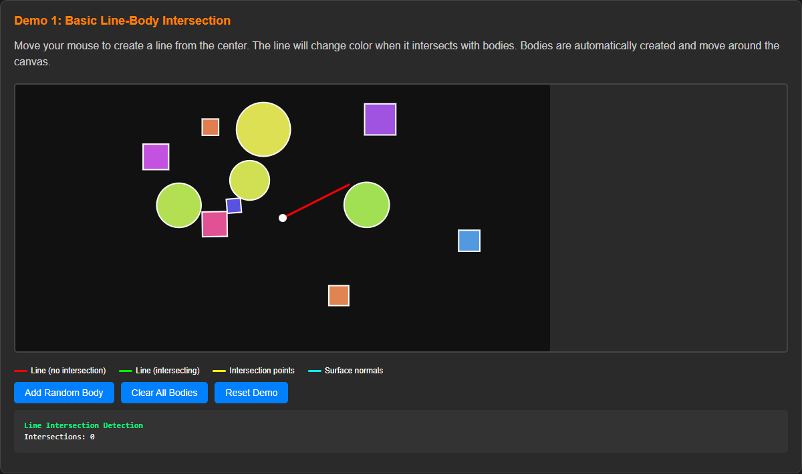
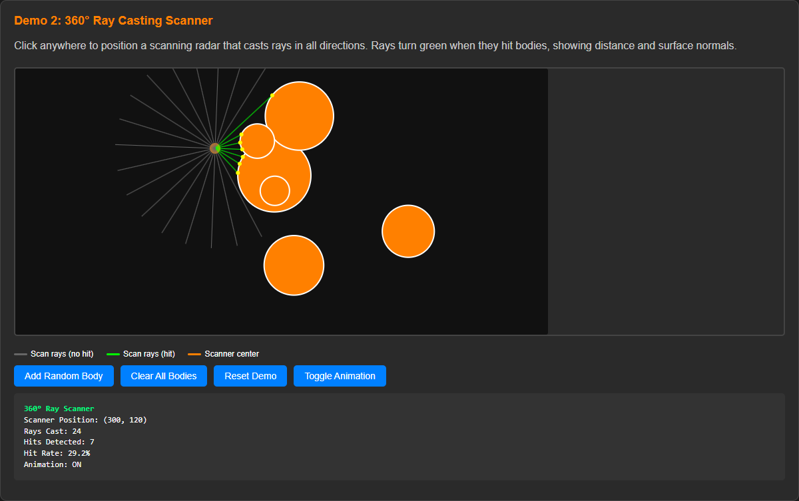
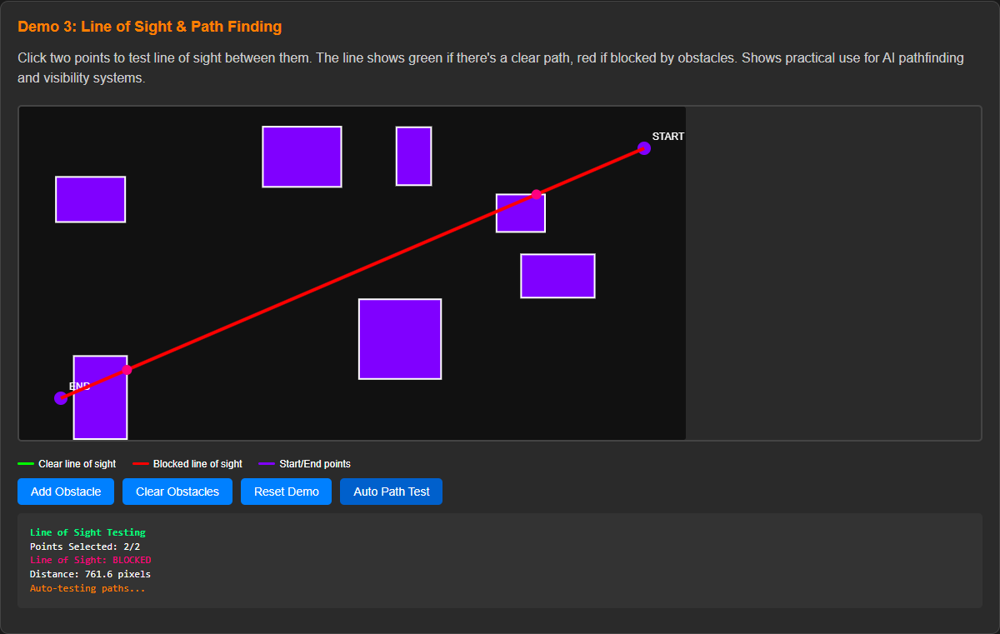
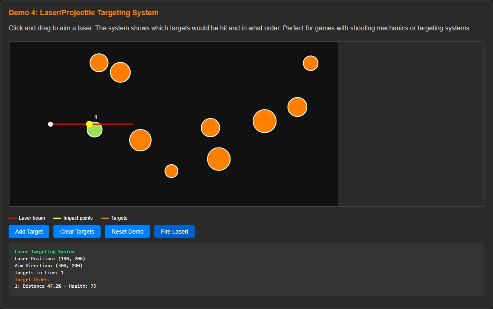

# PlankJS Line Overlap Detection Demo

This is a self-contained demo package for PlankJS line overlap detection capabilities.

## Contents

-   `line-overlap-demo.html` - Interactive HTML demo with 4 examples
-   `lib/` - Required libraries
    -   `planck.min.js` - PlankJS physics engine v1.4.2
-   `js/` - Line overlap detection implementation
    -   `lineoverlap.js` - Core line overlap detection system
    -   `lineoverlap-examples.js` - Usage examples and utilities
-   `docs/` - Documentation
    -   `LINE_OVERLAP_DETECTION.md` - Comprehensive API documentation

## Quick Start

1. Open `line-overlap-demo.html` in your web browser
2. Interact with the four demos:

### Demo 1: Basic Line-Body Intersection

Click to draw lines and see overlap detection with moving physics bodies.

### Demo 2: 360° Ray Casting Scanner

Watch continuous scanning for nearby objects with visual ray feedback.

### Demo 3: Line of Sight & Path Finding

Click to check visibility between points with obstacle avoidance.

### Demo 4: Laser/Projectile Targeting System

Interactive laser beam with collision detection and damage system.## Using in Your Project

1. Include PlankJS: ``
2. Include the detector: ``
3. Create a detector instance: `const detector = new LineOverlapDetector(world);`
4. Check for overlaps: `const overlaps = detector.checkLineOverlap(startPoint, endPoint);`

See `docs/LINE_OVERLAP_DETECTION.md` for complete API documentation and examples.

## Browser Compatibility

-   Modern browsers with ES6+ support
-   HTML5 Canvas support required for demos
-   No additional dependencies beyond PlankJS

## Features

-   Efficient raycasting-based detection
-   Support for all PlankJS shape types (circles, boxes, polygons)
-   Customizable filtering options
-   Coordinate conversion utilities
-   Multiple query strategies (raycast, AABB+raycast, boolean checks)
